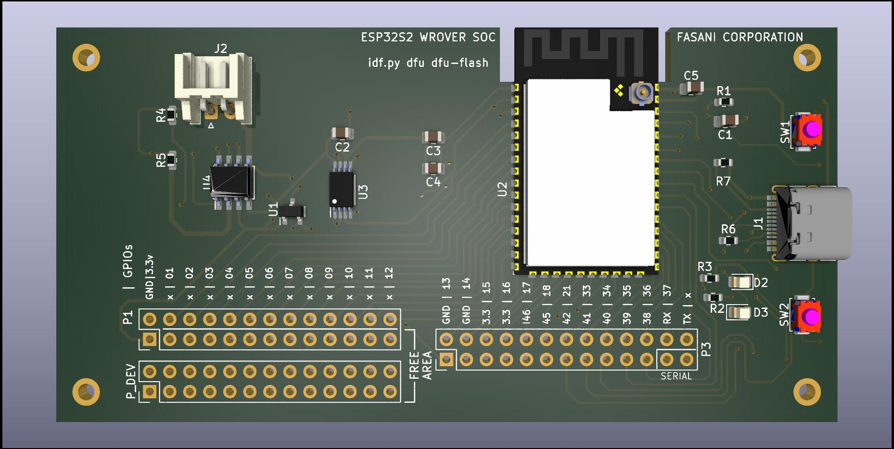

## A simple open source S2-WROVER board with DFU USB

H stands for Hardware. First board is a simple S2-WROVER dev board.

Initial dimensions:
99x50mm

This board aims to be the simplest possible configuration to have a breakout PCB to start developing something with Espressif S2.
The minimun requirements are:

- Lipo charger and a 2 leds indicator (charge, full)
- All GPIOs exposed
- No Serial-to-UART. Only dfu USB, please check this [blog post from Espressif](https://blog.espressif.com/dfu-using-the-native-usb-on-esp32-s2-for-flashing-the-firmware-b2c4af3335f1)

## EPDiy S2 parallel epaper controller

EPDiy S2 an experimental project for 8 data lines Kindle like einks, on a very early stage, still untested:

This is based on original [epdiy V6 PCB](https://github.com/vroland/epdiy/tree/master/hardware/epaper-breakout) a project by @vroland. What is changed in this version is that it does not use PCA9555 port expander and also takes profit of the S2 feature of direct firmware updates using the USB port. 
This version aims to use a slightly bigger PMIC (7mm that has a 0.5 mm pitch) albeit will support only displays that consume up to 130 mA. Also the software needs to change since we ditched out the GPIO expander with the aim to have a simpler and cheaper PCB.

Still a work in progress, no Gerbers, no pick-place and no production files at all. It needs testing before everything can be published.
